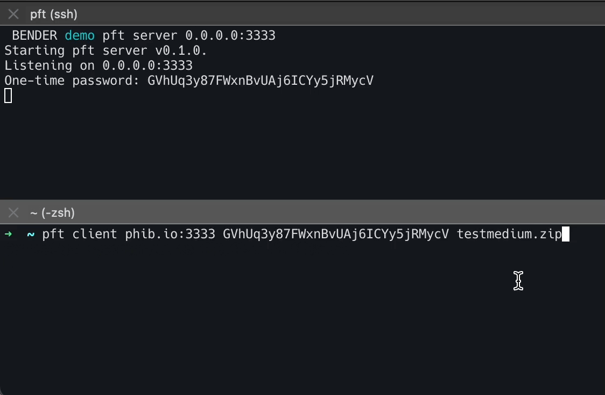

# pft
sim**p**le **f**ile **t**ransfer server/client built to learn more about Rust, TCP and protocols.

## Usage
tbd.
## Application Layer Protocol
### Client Requests 
#### AnnounceFileTransfer
| u8   | u16                           | [u8]        |  u16    | [u8]        |
| ---- | ------ | ----------- | ---------- | --------------- |
| Request type | filename length | filename value bytes | password length | password value bytes |

#### UploadFile
| u8           | u8            |  u16   | [u8]                 | [u8]             |
| ------------ | ------------- | --- | -------------------- | ---------------- |
| Request type | transfer type |  filename length   | filename value bytes | file value bytes |

#### Request Type
- AnnounceFileTransfer = 1
- UploadFile = 2

#### Transfer Type
- Normal = 1
- Replace = 2
- KeepBoth = 3

### Server Response
#### Response
| u16   | [u8]     | u8        |
| ---- | ------ | ----------- | 
| message length | message value bytes | error type | 

#### Error Type 
- None = 0,
- InvalidPassword = 1,
- FileAlreadyExists = 2
